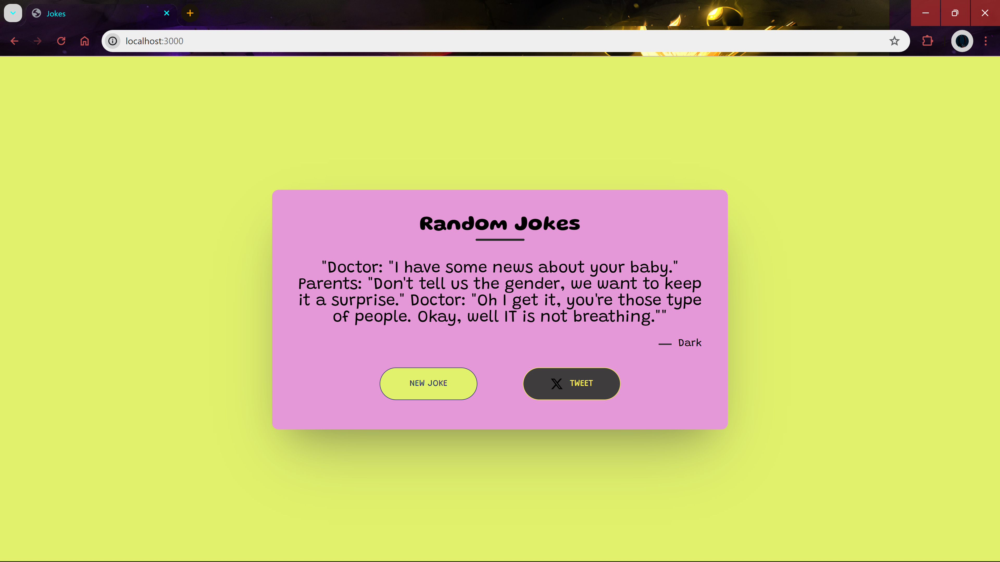
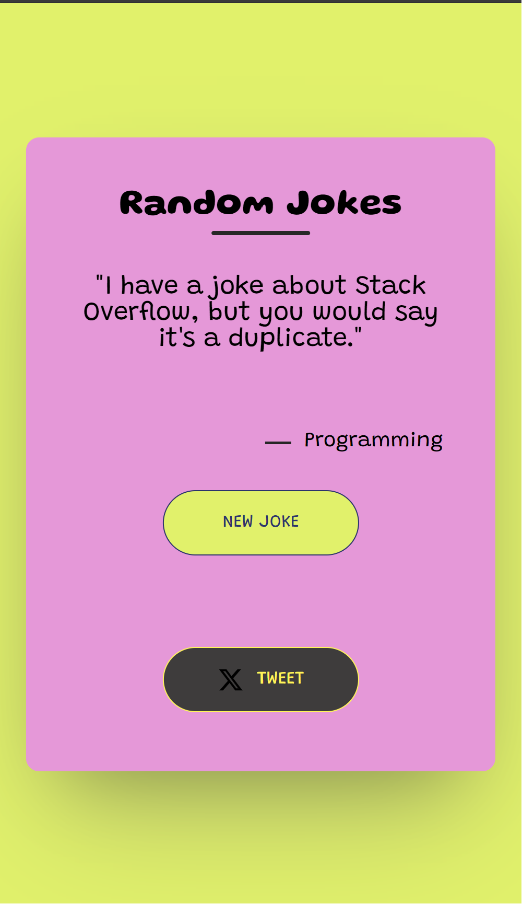

# Joke Web App

This is a simple web application that fetches random jokes from an API and allows users to tweet them.

## Features

- Fetches random jokes from the JokeAPI.
- Displays the fetched joke along with its category.
- Allows users to fetch a new joke with the "NEW JOKE" button.
- Allows users to tweet the current joke with the "TWEET" button.

## Technologies Used

- Frontend: HTML, CSS, JavaScript
- Backend: Node.js, Express
- External APIs: JokeAPI (https://v2.jokeapi.dev)

## Dependencies

- [Node.js](https://nodejs.org): JavaScript runtime environment.
- [Express](https://expressjs.com): Web application framework for Node.js.
- [Axios](https://github.com/axios/axios): Promise-based HTTP client for the browser and Node.js.
- [Body-parser](https://www.npmjs.com/package/body-parser): Middleware for parsing incoming request bodies.
- [EJS](https://ejs.co): Embedded JavaScript templating for generating dynamic HTML.
  
## Getting Started

1. Ensure you have Node.js installed on your machine. You can download it from [here](https://nodejs.org).

2. Clone this repository to your local machine:
git clone (https://github.com/your-username/joke-web-app.git)

3. Navigate to the project directory: 
cd joke-web-app

4. Install dependencies using npm:
npm install

5. Start the server:
npm start

6. Open your web browser and navigate to `http://localhost:3000` to view the app.

## Screenshot

